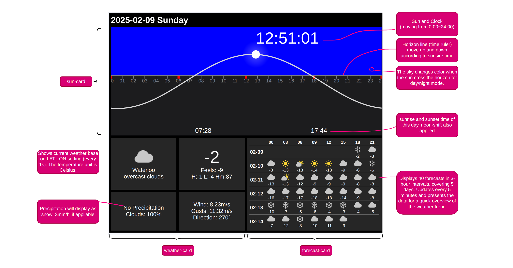
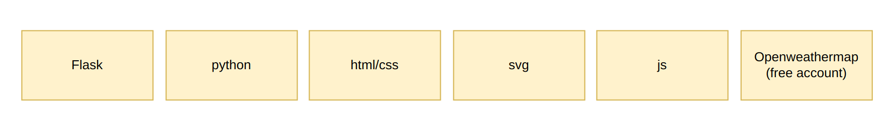
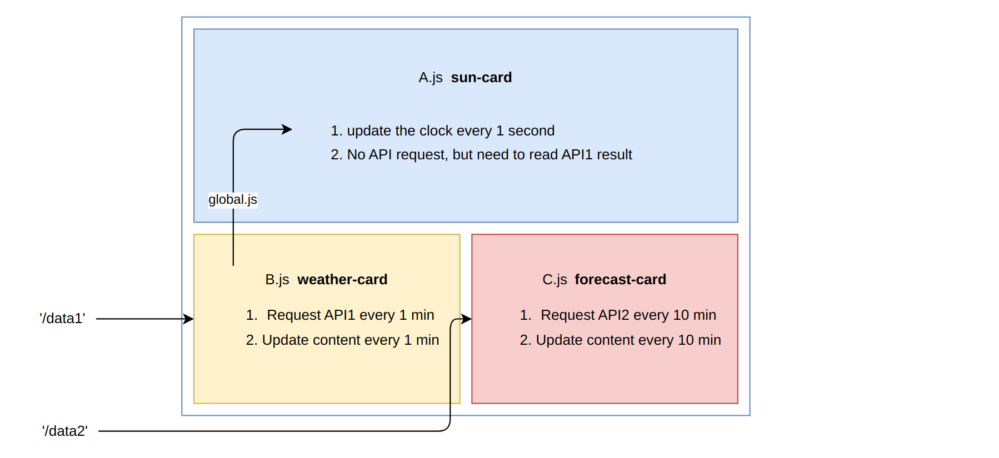

# 1. (Work16) Pi Dashboard

Working on build a dashboard webpage on a Rasberry Pi, it has datetime and weather info.

It costed me about 4 days to achieve this effect:


## 1.1. Functions

1. It shows the clock and reminds the sunset and sunrise time
2. It shows the process of time in a day throught the 24-hour ruler
3. It shows the current weather and 5-day forecast
4. It mainly has a dark theme so it's quite okay to display it all the time as a dashboard at the doorway.

### 1.1.1. How you can deploy it in your own machine in 1 minute.

Well it's simple and has many ways, the simplest way is :

```py
#git pull the code, the code is in this folder:
"22-PiDashboard-V1.0-Release"
#0 go to `app.py` and set your own localtion LAT-LON
LAT, LON = 43.47053, -80.56186
#1 run this to install dependencies
pip install -r requirements.txt
#2 run the website (you need to first cd to where app.py sits)
python3 app.py
```

Then you can open your browser at address `localhost:5000` and see the dashboard.

Alternatively you can use other WGSI tools to host the website, that is beyond the topic of this project.

```sh
gunicorn -w 4 -b 0.0.0.0:8000 app:app
```

Effect of running on a 19-inch old screen .


## 1.2. How I build it/ How does it work

### Technology stack


I use Flask+python for the backend, use pure css/html/js for the front end. The sun-card is dranwn using svg. The weather data is fetched from Openweathermap.com with a free account.

### Control flow / Data flow



The control flow for this little dashboard website is simple. app.py is the backend, it has only one thread running the server. Backend does not do anything actively. It offers '/data1' and '/data2' endpoints.

1. '/data1' has the weather data for 'weather-card', it also contains sunset infor for 'sun-card'.
2. '/data2' has the 5 days' forcast info.

The frontend has 4 js files. global.js is the sun-data that B passes to A.

- A runs at 1hz to update sun and clock, it has a internal divider to run every 1min to update sun curve and horizon.
- B runs every 1 min to get '/data1' and update all the components in 'weather-card'
- C runs every 10 min to get '/data2' and update the 'forecast-card'.

When page is loaded:

- A delays 1 second to wait for B's data
- B and C run to get data without delay.

---EndofFile---
