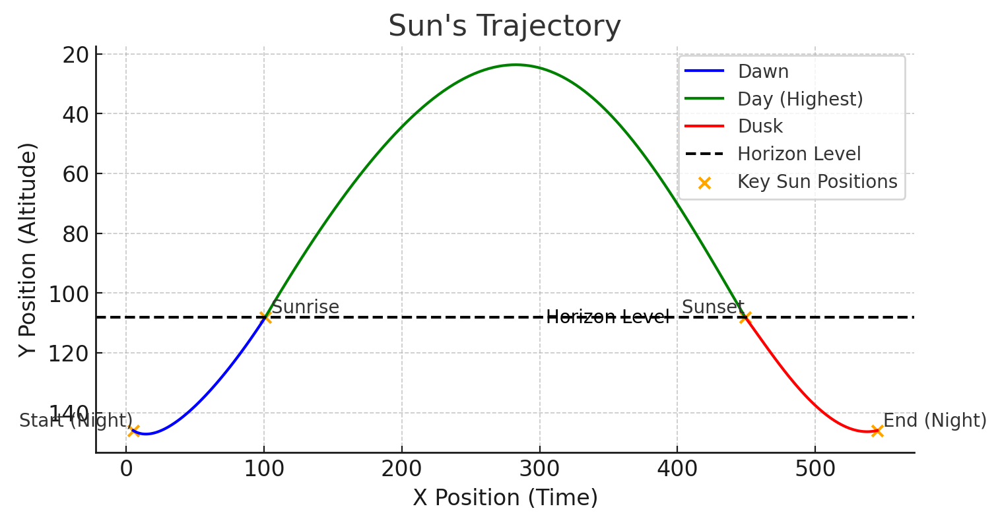
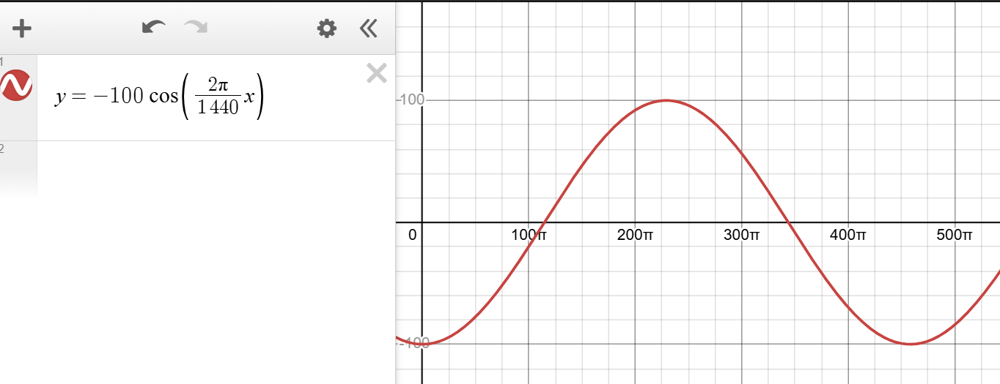

# W16_PiDashboard

working on build a dashboard webpage on a Rasberry Pi, it has datetime and weather info.

## References

1. https://www.timeanddate.com/sun/canada/waterloo
2. https://andrewmarsh.com/apps/releases/sunpath2d.html
3. https://kitchenerwaterloo.weatherstats.ca/
4. https://www.smarty.ninja/ecosystems-en/home-assistant/tracking-sun-and-moon-in-home-assistant/#google_vignette
5. https://weather.wilmslowastro.com/index.php

### Reference 1. Apple weather app

### Reference 2. hass (home assistant sun card)

Link : https://github.com/AitorDB/home-assistant-sun-card

| Day                                            | Night                                              |
| ---------------------------------------------- | -------------------------------------------------- |
|  |  |

|                                                                        |                                                                     |
| ---------------------------------------------------------------------- | ------------------------------------------------------------------- |
| **hass** is using a fixed Bezier curve. It's **NOT** my best choice.   |  |
| Sine wave looks better: [https://www.desmos.com/calculator/nqfu5lxaij] |               |
