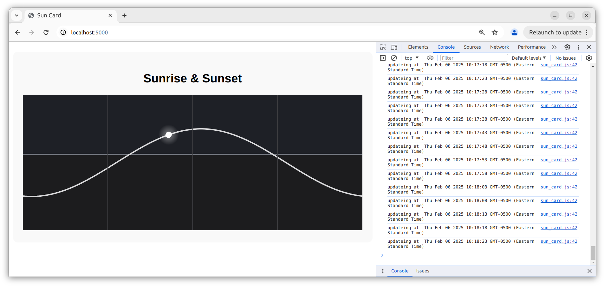
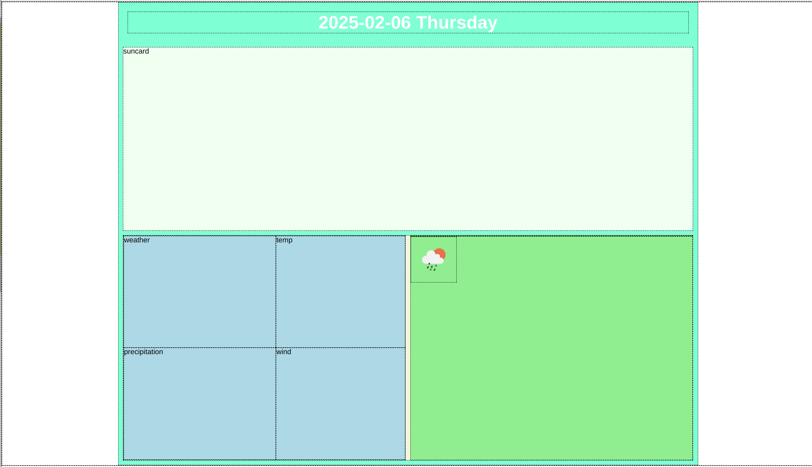
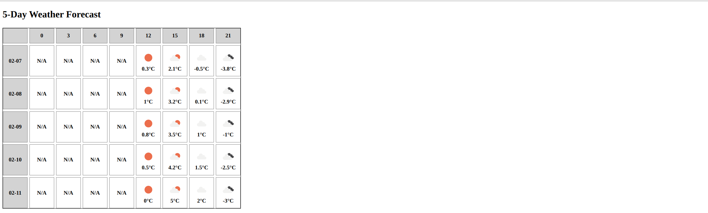

# Project Log

## [2025-02-05 19:41:26] sun card

## [2025-02-06 17:58:42] requesting openweather data

## [2025-02-06 21:31:17] displaying weather data

Planning the layout for weather and forcasts.

2025-02-07 00:23:43

## Integrating 3 parts together [2025-02-07]

### Final effect

### Handwritten notes
