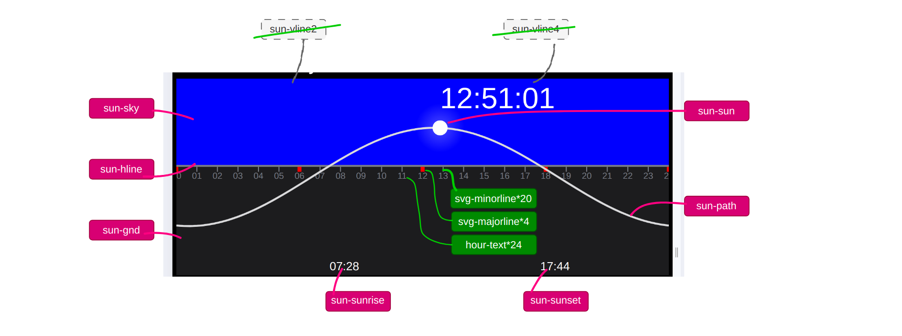
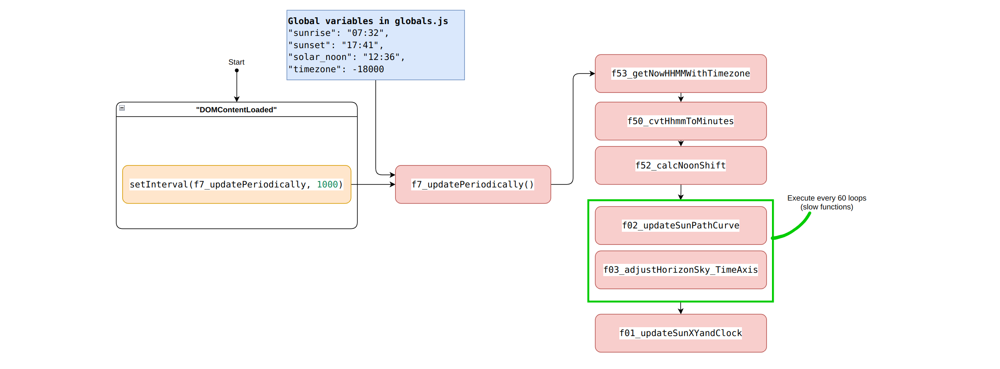
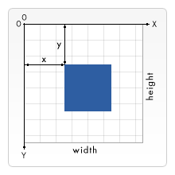
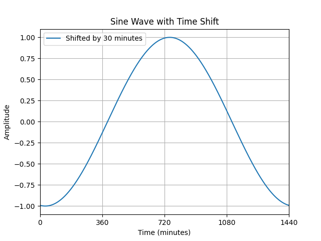
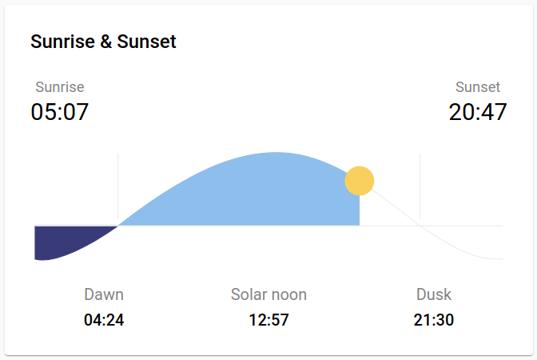
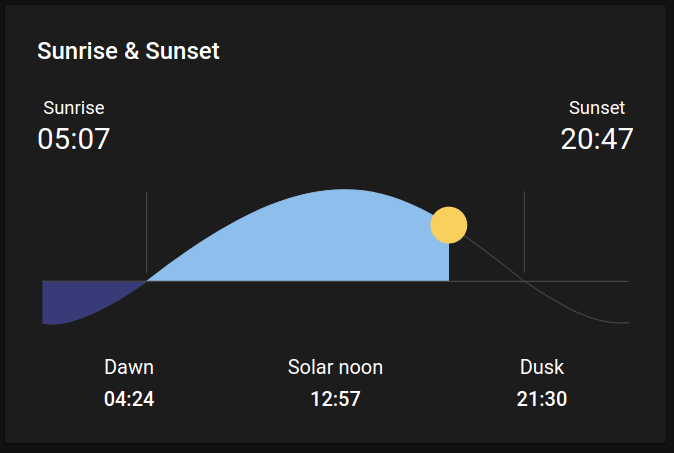
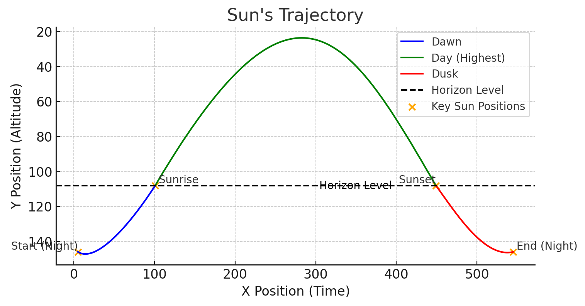
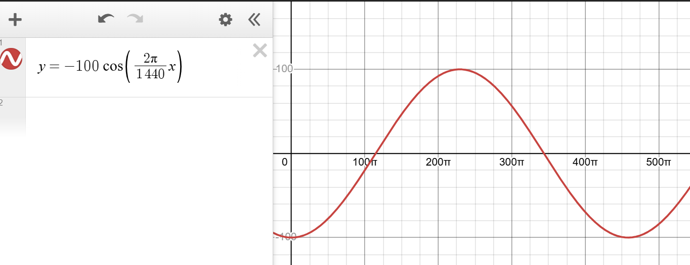

# 1. Drawing sun-card svg on 500x200 coordinate

In this project I leanred how to use svg to draw the sun-card, I put the detailed notes in this .md file.

<!-- TOC depthFrom:2 orderedList:true -->

- [1. Drawing sun-card svg on 500x200 coordinate](#1-drawing-sun-card-svg-on-500x200-coordinate)
  - [1.1. sun-card.js Structure](#11-sun-cardjs-structure)
    - [1.1.1. A new structure in \[2025-02-07\]](#111-a-new-structure-in-2025-02-07)
  - [1.2. Coordinate system](#12-coordinate-system)
  - [1.3. How the svg fit it's parent box](#13-how-the-svg-fit-its-parent-box)
  - [1.4. Draw the sun path](#14-draw-the-sun-path)
    - [1.4.1. References](#141-references)
    - [1.4.2. Reference 1. Apple weather app](#142-reference-1-apple-weather-app)
    - [1.4.3. Reference 2. hass (home assistant sun card)](#143-reference-2-hass-home-assistant-sun-card)
  - [1.5. `sun-path` data looks like](#15-sun-path-data-looks-like)
  - [1.6. Color settings](#16-color-settings)
  - [1.7. JS datetime format converting](#17-js-datetime-format-converting)
  - [1.8. Use SVG Gradients](#18-use-svg-gradients)
  - [1.9. Question, I can only place 'f3, f2, f6, f4' in f1 in this case.](#19-question-i-can-only-place-f3-f2-f6-f4-in-f1-in-this-case)
  - [1.10. Add new line to svg using js](#110-add-new-line-to-svg-using-js)

<!-- /TOC -->

## 1.1. sun-card.js Structure

Suncard structure:

Suncard svg layout:


> Note: `500` in width and `200` in height is hard-coded.

### 1.1.1. A new structure in [2025-02-07]

I have a new version for this part. I add a time axis (time ruler) at the horizon line. In this way, it's more clear to show the 24 hours in a day and the association with the solar movement. I believe this is a wonderful idea and I don't see anywhere else has this design.

1. Remove all local global variables
2. Refacotor functions into only 3.
3. Divide function into two categories: slow, fast.
   The UI layout:
   
   The js code structure:
   

## 1.2. Coordinate system

`viewBox="0 0 500 200"` as "x1, y1, width, height", where the (x1, y1) is the top-left corner of the SVG's coordinate system.



## 1.3. How the svg fit it's parent box

The parent container may have a different aspect ratio other than svg's `viewBox`.
`preserveAspectRatio="align meetOrSlice"
`

| Value                 | Behavior                                                                        |
| --------------------- | ------------------------------------------------------------------------------- |
| **`"xMidYMid meet"`** | Scales **proportionally** so that the **entire SVG fits** inside the container. |
| **`xMinYMin meet`**   | Aligns to **top-left**, scales proportionally.                                  |
| **`xMaxYMax meet`**   | Aligns to **bottom-right**, scales proportionally.                              |
| **`xMidYMid slice`**  | Fills the container completely, but **might crop** parts of the SVG.            |

## 1.4. Draw the sun path

```py
import numpy as np
import matplotlib.pyplot as plt

T = 24 * 60  # Period = 1440 minutes
N = 30  # Shift by 30 minutes
A = 1  # Amplitude
C = 0  # Offset
t = np.linspace(0, T, 1000)  # Time vector for one full cycle

# Generate shifted sine wave
y = -A * np.cos(2 * np.pi * t / T - (2 * np.pi * N / T)) + C

# Plot the sine wave
plt.plot(t, y, label=f"Shifted by {N} minutes")
plt.xlabel("Time (minutes)")
plt.ylabel("Amplitude")
plt.title("Sine Wave with Time Shift")
plt.legend()
plt.grid()

# Set x-axis ticks at 6-hour intervals (0, 360, 720, ...)
x_ticks = np.arange(0, T + 1, 60*6)  # 6-hour intervals
plt.xticks(x_ticks)
plt.xlim(0, T)  # Set x-axis range from 0 to 1440

plt.show()
```



### 1.4.1. References

1. https://www.timeanddate.com/sun/canada/waterloo
2. https://andrewmarsh.com/apps/releases/sunpath2d.html
3. https://kitchenerwaterloo.weatherstats.ca/
4. https://www.smarty.ninja/ecosystems-en/home-assistant/tracking-sun-and-moon-in-home-assistant/#google_vignette
5. https://weather.wilmslowastro.com/index.php

### 1.4.2. Reference 1. Apple weather app


### 1.4.3. Reference 2. hass (home assistant sun card)

Link : https://github.com/AitorDB/home-assistant-sun-card

| Day                                            | Night                                              |
| ---------------------------------------------- | -------------------------------------------------- |
|  |  |

|                                                                        |                                                                     |
| ---------------------------------------------------------------------- | ------------------------------------------------------------------- |
| **hass** is using a fixed Bezier curve. It's **NOT** my best choice.   |  |
| Sine wave looks better: [https://www.desmos.com/calculator/nqfu5lxaij] |               |

## 1.5. `sun-path` data looks like

```
M 0,50 20,48 40,45 60,42 80,38 100,33 120,28 140,22 160,16 180,10 200,5 220,3 240,1

M x1,y1 x2,y2 ....
```

## 1.6. Color settings

Reference: ColorNames https://www.w3.org/TR/SVG11/types.html#ColorKeywords

```css
day sky #223d5d
night sky #1e2026
path #dadadc
grid #414144

```

## 1.7. JS datetime format converting

Converting these datetime formats <br>
`"sunset": "2025-02-05T17:41:01-05:00",` or <br>
`"sunset": "5:41:01 PM",` <br>
to ===>  
 `"sunset": "17:41" `.

```js
function formatSunsetTime(sunset) {
  let date;

  // Check if input is in ISO 8601 format (e.g., "2025-02-05T17:41:01-05:00")
  if (sunset.includes("T")) {
    date = new Date(sunset);
  }
  // Check if input is in 12-hour format (e.g., "5:41:01 PM")
  else {
    date = new Date(`1970-01-01T${sunset}`);
  }

  // Extract hours and minutes in 24-hour format
  let hours = date.getHours().toString().padStart(2, "0");
  let minutes = date.getMinutes().toString().padStart(2, "0");

  return `${hours}:${minutes}`;
}

// Example Usage
console.log(formatSunsetTime("2025-02-05T17:41:01-05:00")); // Output: "17:41"
console.log(formatSunsetTime("5:41:01 PM")); // Output: "17:41"
```

## 1.8. Use SVG Gradients

Here I use only one circle instead of two. what the trick here is the `30%` and `31%`.

If I don't have the `30%` line of code:

After I add the `30%`, the edge of the sun is solid then.


```html
<!-- Define a radial gradient -->
<defs>
  <radialGradient id="glowGradient" cx="50%" cy="50%" r="50%">
    <stop offset="0%" stop-color="white" />
    <stop offset="30%" stop-color="white" stop-opacity="1" />
    <stop offset="31%" stop-color="white" stop-opacity="0.3" />
    <stop offset="100%" stop-color="rgba(255, 255, 255, 0)" stop-opacity="0" />
  </radialGradient>
</defs>

<!-- Apply the gradient to a circle -->
<circle id="svg-sun" cx="-20" cy="-20" r="15" fill="url(#glowGradient)"></circle>
<!-- <circle id="sun1" cx="390" cy="100" r="5" fill="white"></circle> -->
```

## 1.9. Question, I can only place 'f3, f2, f6, f4' in f1 in this case.

Here is a problem, if I put `f3, f2, f6, f4` after f5, they won't work. I don't know why.
[2025-02-06 10:34:39]

```js
document.addEventListener("DOMContentLoaded", function () {
  f1_fetchSunData();
  f5_addGridLines();
  // Fetch sun data every 30 seconds
  setInterval(f4_updateSunXY, 5000); // 30,000 milliseconds = 30 seconds
});

let g_sunData = {}; // Global variable
let g_noonShift = 0; // noon shift in minutes, if solar_noon=11:30, noon_shift=-30

function f1_fetchSunData() {
  fetch("/sun-data")
    .then((response) => response.json())
    .then((data) => {
      g_sunData = data; // Store data globally
      f3_calcNoonShift(g_sunData.solar_noon);
      f2_generateSunPath(); // Draw the trajectory
      f6_adjustHorizon();
      f4_updateSunXY();
    });
}
```

> [2025-02-09 13:33:52] The reason is that `fetch()` is asychronous and doesn't block the execution flow, the `.then` is excuted after receiving the response which is about 50ms later. That means if you put `f2(), f2() ...` after f5(), these functions will execute without valid data before `.then()` actually.

## 1.10. Add new line to svg using js

The two code snippnets have the same effect.

```js
// Add vertical reference lines at x = 0, 1/4T, 1/2T, 3/4T, 1T
function f5_addGridLines() {
  let svg = document.querySelector("svg");
  let T = 24 * 60; // Full period (1440 minutes)
  let svgWidth = 500; // SVG width in pixels
  let positions = [0, 1 / 4, 1 / 2, 3 / 4, 1].map((p) => p * svgWidth);

  positions.forEach((x) => {
    let line = document.createElementNS("http://www.w3.org/2000/svg", "line");
    line.setAttribute("x1", x);
    line.setAttribute("y1", 0);
    line.setAttribute("x2", x);
    line.setAttribute("y2", 200);
    line.setAttribute("stroke", "#414144");
    line.setAttribute("stroke-width", "1");
    svg.appendChild(line);
  });
}
```

```html
<svg id="sun-svg" viewBox="0 0 500 200" preserveAspectRatio="xMidYMid meet">
  <rect id="svg-sky" x="0" y="0" width="500" height="100" fill="#1e2026" />
  <rect id="svg-gnd" x="0" y="100" width="500" height="100" fill="#1c1c1e" />
  <line id="svg-hline" x1="0" y1="100" x2="500" y2="100" stroke="#797d86" stroke-width="2" />
  <line id="svg-vline1" x1="0" y1="0" x2="0" y2="200" stroke="#414144" stroke-width="1" />
  <line id="svg-vline2" x1="125" y1="0" x2="125" y2="200" stroke="#414144" stroke-width="1" />
  <line id="svg-vline3" x1="250" y1="0" x2="250" y2="200" stroke="#414144" stroke-width="1" />
  <line id="svg-vline4" x1="375" y1="0" x2="375" y2="200" stroke="#414144" stroke-width="1" />
  <line id="svg-vline4" x1="500" y1="0" x2="500" y2="200" stroke="#414144" stroke-width="1" />
</svg>
```

--end of file--
